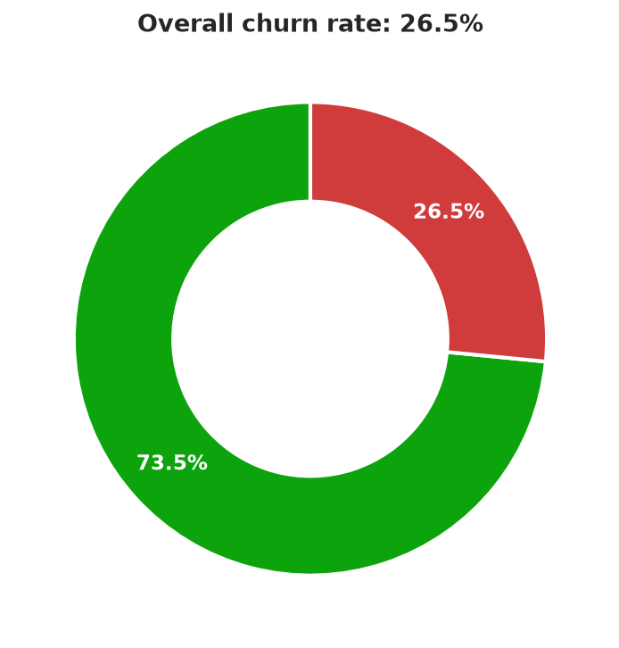
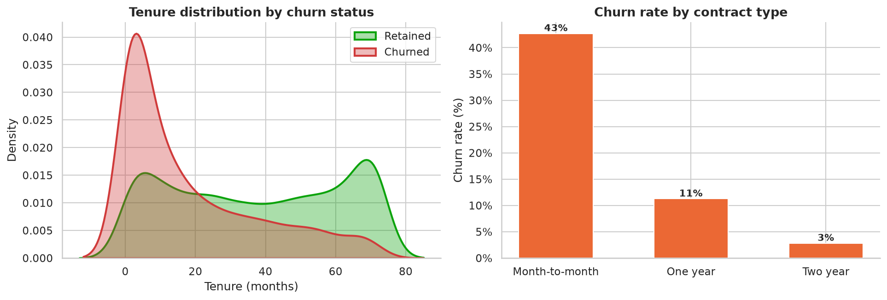

# Telecom Customer Churn — Exploratory Data Analysis

Exploratory data analysis of telecom customer churn using **Python, Pandas, Matplotlib, and Seaborn** — identifying
which customer segments are most likely to churn and why, to inform a retention strategy.

## Dataset

[IBM Telco Customer Churn](https://community.ibm.com/community/user/businessanalytics/blogs/steven-macko/2019/07/11/telco-customer-churn-1113) —
7,043 customers, 21 attributes covering demographics, account tenure, subscribed services, billing method, and
churn status. Stored locally at [`data/telco_customer_churn.csv`](data/telco_customer_churn.csv).

## Project structure

```
customer-churn-analysis/
├── data/
│   └── telco_customer_churn.csv       # raw dataset
├── notebooks/
│   └── customer_churn_eda.ipynb       # full EDA notebook (cleaning, analysis, charts)
├── images/                            # chart exports used below
└── requirements.txt
```

## How to run

```bash
cd customer-churn-analysis
pip install -r requirements.txt
jupyter notebook notebooks/customer_churn_eda.ipynb
```

## Approach

1. **Data cleaning** — coerced `TotalCharges` to numeric (blank values only occur for brand-new customers with
   `tenure == 0`, filled with 0), standardized `SeniorCitizen` to `Yes`/`No`, dropped the `customerID` identifier.
2. **Univariate & bivariate EDA** — churn rate overview, then churn rate broken out by demographics, tenure,
   contract type, subscribed services, billing method, and monthly/total charges.
3. **Correlation analysis** — relationship between tenure, charges, and churn.
4. **Insights & recommendations** — translated the patterns into concrete retention actions.

## Key findings

**Overall churn rate: 26.5%** — about 1 in 4 customers leaves.

| | |
|---|---|
|  |  |

- **Contract type is the strongest churn driver**: month-to-month customers churn at **43%**, vs. **11%** for
  one-year and just **3%** for two-year contracts.
- **Early tenure is the highest-risk window** — churned customers are heavily concentrated in their first few
  months, while retained customers skew toward longer tenure.
- **Missing support add-ons correlate with churn** — customers without `OnlineSecurity` or `TechSupport` churn
  noticeably more than those with them; fiber-optic internet customers churn more than DSL customers.
- **Billing friction matters** — customers paying by **electronic check** and those on **paperless billing** churn
  more than those on automatic payment methods.
- **Correlation with churn**: tenure `-0.35` (strong negative), `TotalCharges` `-0.20` (negative), `MonthlyCharges`
  `+0.19` (positive) — consistent with loyal, longer-tenured customers being the lowest risk.
- Demographics (gender) show **little effect**; senior citizens churn somewhat more than non-seniors.

See the [full notebook](notebooks/customer_churn_eda.ipynb) for all charts (demographics, services, billing) and
the complete write-up.

## Recommendations

- Incentivize month-to-month customers to convert to annual contracts (the single biggest lever).
- Strengthen onboarding and proactive check-ins in the first 3–6 months, the highest-risk window.
- Promote `OnlineSecurity` / `TechSupport` bundles, especially to fiber-optic customers.
- Investigate friction in the electronic-check / paperless-billing experience.
- Use this feature set as the basis for a follow-up predictive churn model to score and target at-risk customers.

## Tools

Python · Pandas · NumPy · Matplotlib · Seaborn · Jupyter
